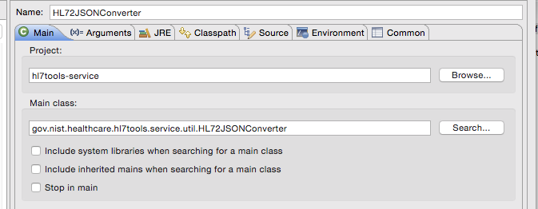
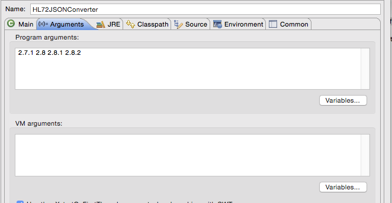

#Dependency of HL7Tools to IGAMT Lite

A command line program that prepares data from the official HL7v2 database (Frank's) for ultimate 
inclusion into the IGAMT database.  It reads from an instance of mySQL and writes *.json files to the 
resources directory of this project.  These resources must be included in the *.jar file packaged from
this project.

Before this program can be run, one must transfer the following tables from the official HL7v2 standards database into a
mySQL database: 
	hl7messagetypes
	hl7versions
	hl7msgstructids
	hl7msgstructidsegments
	hl7segmentdataelements
	hl7datastructures
	hl7datastructurecomponents
	hl7components
	hl7tablevalues
	hl7dataelements
	hl7tables
	hl7events
	hl7eventmessagetypes
	
The transfer process:

Use MS Access to export the tables to MS Excel work sheets.
Use MS Excel to export the work sheets to *.csv files.
Create a database in mySQL called mdb.
Import the *.csv files into mdb.
Inside eclipse, run gov.nist.healthcare.hl7tools.service.util.HL72JSONConverter with hl7 versions as arguments.
###Program to run:

###Program arguments:

###Install to the Maven repository:

One must run and install the above before running the converter (below). If not, the *.json files will be out of date.

###To run:
	 Run from inside the eclipse IDE.  In the launch configuration, pass versions as program arguments.
	 e.g. 2.1 2.2 2.3 
	
###Program outputs *.json files to the src/main/resources/hl7db/<version>

###To install:
	Run maven install from inside eclipse.

